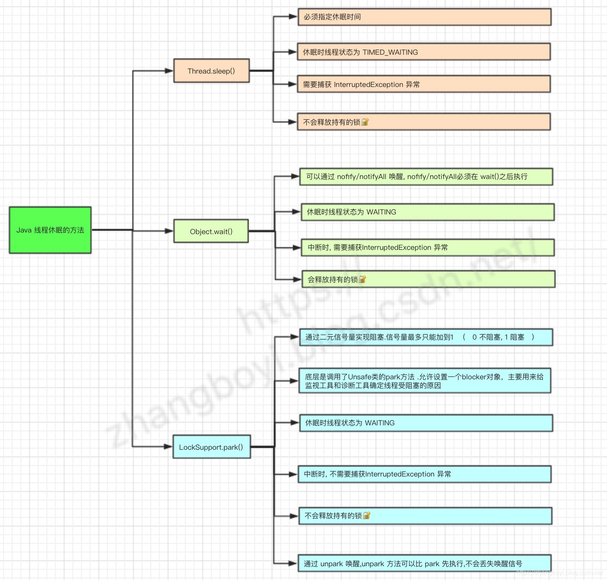

# sleep、yield、wait、join的区别

1.sleep：Thread类的方法，必须带一个时间参数。**会让当前线程休眠进入阻塞状态并释放CPU（阿里面试题 Sleep释放CPU，wait 也会释放cpu，因为cpu资源太宝贵了，只有在线程running的时候，才会获取cpu片段）**，提供其他线程运行的机会且不考虑优先级，但如果有同步锁则sleep不会释放锁即其他线程无法获得同步锁 可通过调用interrupt()方法来唤醒休眠线程。

 

2.yield：**让出CPU调度**，Thread类的方法，类似sleep只是**不能由用户指定暂停多长时间 ，**并且yield()方法**只能让同优先级的线程**有执行的机会。 yield()只是使当前线程重新回到可执行状态，所以执行yield()的线程有可能在进入**到可执行状态后**马上又被执行。调用yield方法只是一个建议，告诉线程调度器我的工作已经做的差不多了，可以让别的相同优先级的线程使用CPU了，没有任何机制保证采纳。

 

3.wait：Object类的方法(notify()、notifyAll()  也是Object对象)，必须放在循环体和同步代码块中，执行该方法的线程会释放锁，进入线程等待池中等待被再次唤醒(notify随机唤醒，notifyAll全部唤醒，线程结束自动唤醒)即放入锁池中竞争同步锁

 

4.join：一种特殊的wait，当前运行线程调用另一个线程的join方法，当前线程进入阻塞状态直到另一个线程运行结束等待该线程终止。 注意该方法也需要捕捉异常。

等待调用join方法的线程结束，再继续执行。如：t.join();//主要用于等待t线程运行结束，若无此句，main则会执行完毕，导致结果不可预测。

