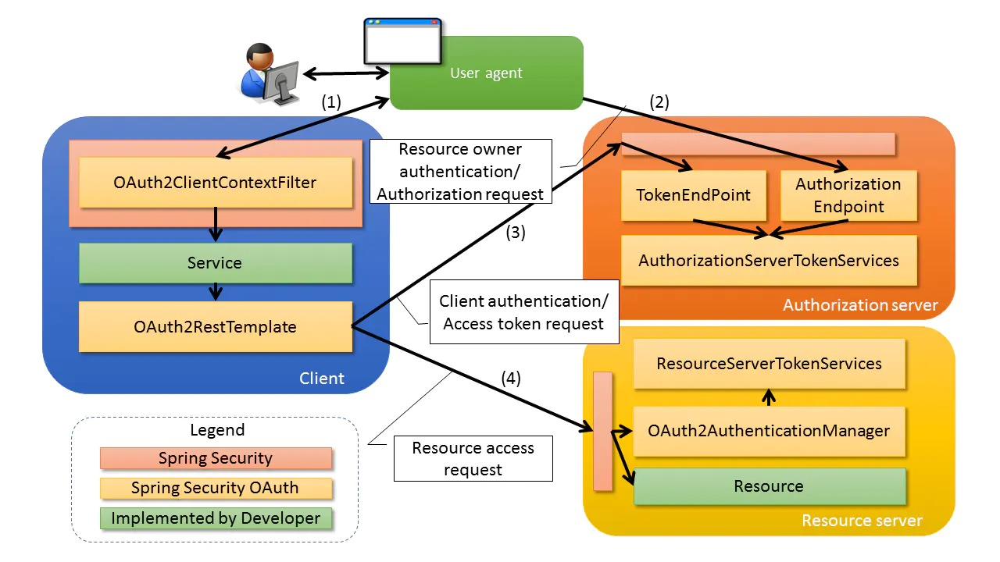
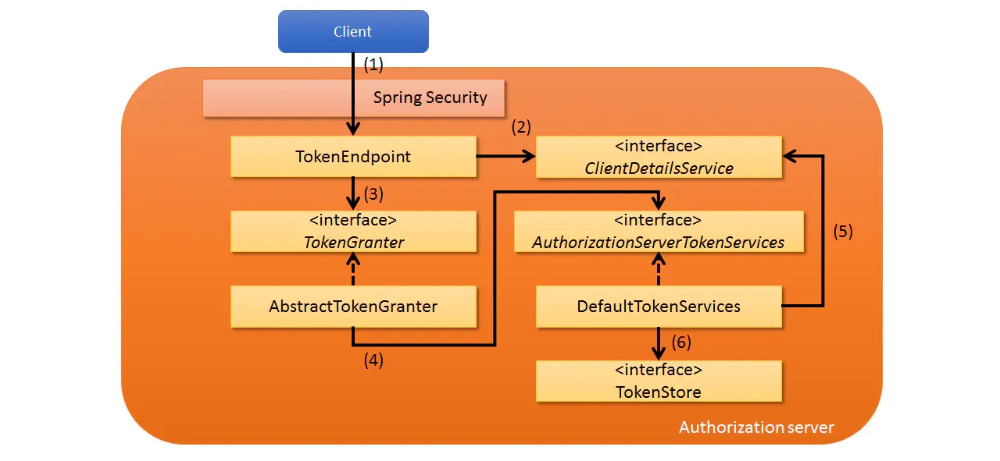
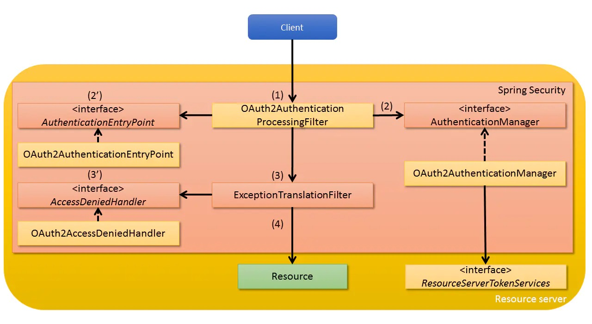

# Spring-Security-OAuth2架构原理

Spring Security OAuth2是一个基于`OAuth2`封装的一个类库，它提供了构建`Authorization Server`、`Resource Server`和`Client`三种`Spring`应用程序角色所需要的功能


## Spring Security OAuth2架构

Spring Security OAuth2是一个基于`OAuth2`封装的一个类库，它提供了构建`Authorization Server`、`Resource Server`和`Client`三种`Spring`应用程序角色所需要的功能。`Spring Security OAuth`需要与`Spring Framework（Spring MVC）`和`Spring Security`提供的功能协同工作，在使用`Spring Security OAuth`构建`Authorization Server`、`Resource Server`和`Client`的情况下，`Spring Security OAuth2`的整体架构图如下：





1. 资源拥有者通过`UserAgent`访问`client`，在授权允许访问授权端点的情况下，`OAuth2RestTemplate`会创建`OAuth2`认证的`REST`请求，指示`UserAgent`重定向到`Authorization Server`的授权端点`AuthorizationEndpoint`。
2. `UserAgent`访问`Authorization Server`的授权端点的`authorize`方法，当未注册授权时，授权端点将需要授权的界面`/oauth/confirm_access`显示给资源拥有者，资源拥有者授权后会通过 `AuthorizationServerTokenServices`生成授权码或访问令牌，生成的令牌最终会通过`userAgent`重定向传递给客户端。
3. 客户端的`OAuth2RestTemplate`拿到授权码后创建请求访问授权服务器`TokenEndpoint`令牌端点，令牌端点通过调用`AuthorizationServerTokenServices`来验证客户端提供的授权码进行授权，并颁发访问令牌响应给客户端。
4. 客户端的`OAuth2RestTemplate`在请求头中加入从授权服务器获取的访问令牌来访问资源服务器，资源服务器通过`OAuth2AuthenticationManager`调用`ResourceServerTokenServices`验证访问令牌和与访问令牌关联的验证信息。访问令牌验证成功后，返回客户端请求对应的资源。

> 上面大致讲解了`Spring Security OAuth2`三种应用角色的执行流程，下面我们将逐个剖析这三种角色的架构和源码来加深理解。

------

## Authorization Server（授权服务器）架构

授权服务器主要提供了资源拥有者的认证服务，客户端通过授权服务器向资源拥有者获取授权，然后获取授权服务器颁发的令牌。在这个认证流程中，涉及到两个重要端点，一个是授权端点`AuthorizationEndpoint`，另一个是令牌端点`TokenEndpoint`。下面将通过源码分析这两个端点的内部运行流程。

### AuthorizationEndpoint（授权端点）

首先让我们来看下访问授权端点`AuthorizationEndpoint`的执行流程：


1. `UserAgent`会访问授权服务器的`AuthorizationEndpoint`（授权端点）的URI：`/oauth/authorize`，调用的是`authorize`方法，主要用于判断用户是否已经授权，如果授权颁发新的authorization_code，否则跳转到用户授权页面。
2. `authorize`它会先调用`ClientDetailsService`获取客户端详情信息，并验证请求参数。
3. 随后`authorize`方法再将请求参数传递给`UserApprovalHandler`用来检测客户端是否已经注册了`scope`授权。
4. 当未注册授权时，即`approved`为`false`，将会向资源拥有者显示请求授权的界面`/oauth/confirm_access`。
5. 同4一致。
6. 资源拥有者确认授权后会再次访问授权服务器的授权端点的URI：`/oauth/authorize`，此次请求参数会增加一个`user_oauth_approval`，因此会调用另一个映射方法`approveOrDeny`。
7. `approveOrDeny`会调用`userApprovalHandler.updateAfterApproval`根据用户是否授权，来决定是否更新`authorizationRequest`对象中的`approved`属性。
8. `userApprovalHandler`的默认实现类是`ApprovalStoreUserApprovalHandler`，其内部是通过`ApprovalStore`的`addApprovals`来注册授权信息的。

当没有携带请求参数`user_oauth_approval`时，会访问`authorize`方法，执行流程和上面1-5步对应，如果用户已经授权则颁发新的`authorization_code`，否则跳转到用户授权页面：

```
@RequestMapping(value = "/oauth/authorize")
public ModelAndView authorize(Map<String, Object> model, @RequestParam Map<String, String> parameters,
    SessionStatus sessionStatus, Principal principal) {
  // 根据请求参数封装 认证请求对象 ----> AuthorizationRequest
  // Pull out the authorization request first, using the OAuth2RequestFactory. 
  // All further logic should query off of the authorization request instead of referring back to the parameters map. 
  // The contents of the parameters map will be stored without change in the AuthorizationRequest object once it is created.
  AuthorizationRequest authorizationRequest = getOAuth2RequestFactory().createAuthorizationRequest(parameters);
  // 获取请求参数中的response_type类型，并进行条件检验：response_type只支持token和code，即令牌和授权码
  Set<String> responseTypes = authorizationRequest.getResponseTypes();
  if (!responseTypes.contains("token") && !responseTypes.contains("code")) {
    throw new UnsupportedResponseTypeException("Unsupported response types: " + responseTypes);
  }
  // 请求参数必须携带客户端ID
  if (authorizationRequest.getClientId() == null) {
    throw new InvalidClientException("A client id must be provided");
  }

  try {
    // 在使用Spring Security OAuth2授权完成之前，必须先完成Spring Security对用户进行的身份验证
    if (!(principal instanceof Authentication) || !((Authentication) principal).isAuthenticated()) {
      throw new InsufficientAuthenticationException(
          "User must be authenticated with Spring Security before authorization can be completed.");
    }
    // 获取客户端详情
    ClientDetails client = getClientDetailsService().loadClientByClientId(authorizationRequest.getClientId());
    // 获得重定向URL，它可以来自请求参数，也可以来自客户端详情，总之你需要将它存储在授权请求中
    // The resolved redirect URI is either the redirect_uri from the parameters or the one from clientDetails.
    // Either way we need to store it on the AuthorizationRequest.
    String redirectUriParameter = authorizationRequest.getRequestParameters().get(OAuth2Utils.REDIRECT_URI);
    String resolvedRedirect = redirectResolver.resolveRedirect(redirectUriParameter, client);
    if (!StringUtils.hasText(resolvedRedirect)) {
      throw new RedirectMismatchException(
          "A redirectUri must be either supplied or preconfigured in the ClientDetails");
    }
    authorizationRequest.setRedirectUri(resolvedRedirect);
    // 根据客户端详情来校验请求参数中的scope
    // We intentionally only validate the parameters requested by the client (ignoring any data that may have been added to the request by the manager).
    oauth2RequestValidator.validateScope(authorizationRequest, client);

    // 此处检测请求的用户是否已经被授权，或者有配置默认授权的权限；若已经有accessToke存在或者被配置默认授权的权限则返回含有授权的对象
    // 用到userApprovalHandler ----> ApprovalStoreUserApprovalHandler
    // Some systems may allow for approval decisions to be remembered or approved by default. 
    // Check for such logic here, and set the approved flag on the authorization request accordingly.
    authorizationRequest = userApprovalHandler.checkForPreApproval(authorizationRequest,
        (Authentication) principal);
    // TODO: is this call necessary?
    // 如果authorizationRequest.approved为true，则将跳过Approval页面。
    boolean approved = userApprovalHandler.isApproved(authorizationRequest, (Authentication) principal);
    authorizationRequest.setApproved(approved);
    // 已授权 直接返回对应的视图，返回的视图中包含新生成的authorization_code（固定长度的随机字符串）值
    // Validation is all done, so we can check for auto approval...
    if (authorizationRequest.isApproved()) {
      if (responseTypes.contains("token")) {
        return getImplicitGrantResponse(authorizationRequest);
      }
      if (responseTypes.contains("code")) {
        return new ModelAndView(getAuthorizationCodeResponse(authorizationRequest,
            (Authentication) principal));
      }
    }

    // Place auth request into the model so that it is stored in the sessionfor approveOrDeny to use.
    // That way we make sure that auth request comes from the session,
    // so any auth request parameters passed to approveOrDeny will be ignored and retrieved from the session.
    model.put("authorizationRequest", authorizationRequest);
    // 未授权 跳转到授权界面，让用户选择是否授权
    return getUserApprovalPageResponse(model, authorizationRequest, (Authentication) principal);

  }
  catch (RuntimeException e) {
    sessionStatus.setComplete();
    throw e;
  }
}
复制代码
```

用户通过授权页面确认是否授权，并携带请求参数`user_oauth_approval`访问授权端点，会执行`approveOrDeny`方法，执行流程对应上面6-7步：

```
@RequestMapping(value = "/oauth/authorize", method = RequestMethod.POST, params = OAuth2Utils.USER_OAUTH_APPROVAL)
public View approveOrDeny(@RequestParam Map<String, String> approvalParameters, Map<String, ?> model,
    SessionStatus sessionStatus, Principal principal) {
  // 在使用Spring Security OAuth2授权完成之前，必须先完成Spring Security对用户进行的身份验证
  if (!(principal instanceof Authentication)) {
    sessionStatus.setComplete();
    throw new InsufficientAuthenticationException(
        "User must be authenticated with Spring Security before authorizing an access token.");
  }
  // 获取请求参数
  AuthorizationRequest authorizationRequest = (AuthorizationRequest) model.get("authorizationRequest");
  if (authorizationRequest == null) {
    sessionStatus.setComplete();
    throw new InvalidRequestException("Cannot approve uninitialized authorization request.");
  }

  try {
    // 获取请求参数中的response_type类型
    Set<String> responseTypes = authorizationRequest.getResponseTypes();
    // 设置Approval的参数
    authorizationRequest.setApprovalParameters(approvalParameters);
    // 根据用户是否授权，来决定是否更新authorizationRequest对象中的approved属性。
    authorizationRequest = userApprovalHandler.updateAfterApproval(authorizationRequest,
        (Authentication) principal);
    boolean approved = userApprovalHandler.isApproved(authorizationRequest, (Authentication) principal);
    authorizationRequest.setApproved(approved);
    // 需要携带重定向URI
    if (authorizationRequest.getRedirectUri() == null) {
      sessionStatus.setComplete();
      throw new InvalidRequestException("Cannot approve request when no redirect URI is provided.");
    }
    // 用户拒绝授权，响应错误信息到客户端的重定向URL上
    if (!authorizationRequest.isApproved()) {
      return new RedirectView(getUnsuccessfulRedirect(authorizationRequest,
          new UserDeniedAuthorizationException("User denied access"), responseTypes.contains("token")),
          false, true, false);
    }
    // 简化模式，直接颁发访问令牌
    if (responseTypes.contains("token")) {
      return getImplicitGrantResponse(authorizationRequest).getView();
    }
    // 授权码模式，生成授权码存储并返回给客户端
    return getAuthorizationCodeResponse(authorizationRequest, (Authentication) principal);
  }
  finally {
    sessionStatus.setComplete();
  }
}
复制代码
```

### TokenEndpoint（令牌端点）

接下来我们看下令牌端点`TokenEndpoint`的执行流程：


1. `userAgent`通过访问授权服务器令牌端点TokenEndpoint的URI：`/oauth/token`，调用的是`postAccessToken`方法，主要用于为客户端生成`Token`。
2. `postAccessToken`首先会调用`ClientDetailsService`获取客户端详情信息并验证请求参数。
3. 调用对应的授权模式实现类生成`Token`。
4. 对应的授权模式都是实现了`AbstractTokenGranter`抽象类，它的成员`AuthorizationServerTokenServices`可以用来创建、刷新、获取`token`。
5. `AuthorizationServerTokenServices`默认实现类只有`DefaultTokenServices`，通过它`的createAccessToken`方法可以看到`token`是如何创建的。
6. 真正操作`token`的类是`TokenStore`，程序根据`TokenStore`接口的不同实现来生产和存储`token`。

下面列出`TokenEndpoint`的URI：`/oauth/token`的源码分析：

```
@RequestMapping(value = "/oauth/token", method=RequestMethod.POST)
public ResponseEntity<OAuth2AccessToken> postAccessToken(Principal principal, @RequestParam
Map<String, String> parameters) throws HttpRequestMethodNotSupportedException {
  // 在使用Spring Security OAuth2授权完成之前，必须先完成Spring Security对用户进行的身份验证
  if (!(principal instanceof Authentication)) {
    throw new InsufficientAuthenticationException(
        "There is no client authentication. Try adding an appropriate authentication filter.");
  }
  // 通过客户端Id获取客户端详情
  String clientId = getClientId(principal);
  ClientDetails authenticatedClient = getClientDetailsService().loadClientByClientId(clientId);
  // 根据请求参数封装 认证请求对象 ----> AuthorizationRequest
  TokenRequest tokenRequest = getOAuth2RequestFactory().createTokenRequest(parameters, authenticatedClient);

  if (clientId != null && !clientId.equals("")) {
    // Only validate the client details if a client authenticated during this
    // request.
    if (!clientId.equals(tokenRequest.getClientId())) {
      // double check to make sure that the client ID in the token request is the same as that in the
      // authenticated client
      throw new InvalidClientException("Given client ID does not match authenticated client");
    }
  }
  if (authenticatedClient != null) {
    // 根据客户端详情来校验请求参数中的scope，防止客户端越权获取更多权限
    oAuth2RequestValidator.validateScope(tokenRequest, authenticatedClient);
  }
  // 没有指定授权模式
  if (!StringUtils.hasText(tokenRequest.getGrantType())) {
    throw new InvalidRequestException("Missing grant type");
  }
  // 访问此端点不应该是简化模式
  if (tokenRequest.getGrantType().equals("implicit")) {
    throw new InvalidGrantException("Implicit grant type not supported from token endpoint");
  }
  // 如果grant_type=authoraztion_code，则清空scope
  if (isAuthCodeRequest(parameters)) {
    // The scope was requested or determined during the authorization step
    if (!tokenRequest.getScope().isEmpty()) {
      logger.debug("Clearing scope of incoming token request");
      tokenRequest.setScope(Collections.<String> emptySet());
    }
  }
  // 如果grant_type=refresh_token，设置刷新令牌的scope
  if (isRefreshTokenRequest(parameters)) {
    // A refresh token has its own default scopes, so we should ignore any added by the factory here.
    tokenRequest.setScope(OAuth2Utils.parseParameterList(parameters.get(OAuth2Utils.SCOPE)));
  }
  // 为客户端生成token
  OAuth2AccessToken token = getTokenGranter().grant(tokenRequest.getGrantType(), tokenRequest);
  if (token == null) {
    throw new UnsupportedGrantTypeException("Unsupported grant type: " + tokenRequest.getGrantType());
  }
  return getResponse(token);
}
复制代码
```

令牌端点最关键的就是如何生产`token`，不同的授权模式都会基于`AbstractTokenGranter`接口做不同实现，`AbstractTokenGranter`会委托`AuthorizationServerTokenServices`来创建、刷新、获取`token`。`AuthorizationServerTokenServices`的默认实现只有`DefaultTokenServices`，简单抽取它的`createAccessToken`方法源码即可看到：

```
// 生成accessToken和RefreshToken
@Transactional
public OAuth2AccessToken createAccessToken(OAuth2Authentication authentication) throws AuthenticationException {
  // 首先尝试获取当前存在的Token
  OAuth2AccessToken existingAccessToken = tokenStore.getAccessToken(authentication);
  OAuth2RefreshToken refreshToken = null;
  // 如果现有的访问令牌accessToken不为空且没有失效，则保存现有访问令牌, 如果失效则重新存储新的访问令牌
  if (existingAccessToken != null) {
    if (existingAccessToken.isExpired()) {
      if (existingAccessToken.getRefreshToken() != null) {
        refreshToken = existingAccessToken.getRefreshToken();
        // The token store could remove the refresh token when the
        // access token is removed, but we want to
        // be sure...
        tokenStore.removeRefreshToken(refreshToken);
      }
      tokenStore.removeAccessToken(existingAccessToken);
    }
    else {
      // Re-store the access token in case the authentication has changed
      tokenStore.storeAccessToken(existingAccessToken, authentication);
      return existingAccessToken;
    }
  }
  // 如果没有刷新令牌则创建刷新令牌，如果刷新令牌过期，重新创建刷新令牌。
  // Only create a new refresh token if there wasn't an existing one associated with an expired access token.
  // Clients might be holding existing refresh tokens, so we re-use it in the case that the old access token expired.
  if (refreshToken == null) {
    refreshToken = createRefreshToken(authentication);
  }
  // But the refresh token itself might need to be re-issued if it has expired.
  else if (refreshToken instanceof ExpiringOAuth2RefreshToken) {
    ExpiringOAuth2RefreshToken expiring = (ExpiringOAuth2RefreshToken) refreshToken;
    if (System.currentTimeMillis() > expiring.getExpiration().getTime()) {
      refreshToken = createRefreshToken(authentication);
    }
  }
  // 生成新的访问令牌并储存，保存刷新令牌
  OAuth2AccessToken accessToken = createAccessToken(authentication, refreshToken);
  tokenStore.storeAccessToken(accessToken, authentication);
  // In case it was modified
  refreshToken = accessToken.getRefreshToken();
  if (refreshToken != null) {
    tokenStore.storeRefreshToken(refreshToken, authentication);
  }
  return accessToken;
}
复制代码
```

------

## Resource Server（资源服务器）架构

资源服务器主要用于处理客户端对受保护资源的访问请求并返回相应。资源服务器会验证客户端的访问令牌是否有效，并获取与访问令牌关联的认证信息。获取认证信息后，验证访问令牌是否在允许的`scope`内，验证完成后的处理行为可以类似于普通应用程序来实现。下面是资源服务器的运行流程：





- (1) 客户端开始访问资源服务器时，会先经过`OAuth2AuthenticationProcessingFilter`，这个拦截器的作用是从请求中提取访问令牌，然后从令牌中提取认证信息`Authentication`并将其存放到上下文中。
- (2) `OAuth2AuthenticationProcessingFilter`拦截器中会调用`AuthenticationManager的authenticate`方法提取认证信息。
- (2·) `OAuth2AuthenticationProcessingFilter`拦截器如果发生认证错误时，将委`托AuthenticationEntryPoint`做出错误响应，默认实现类是`OAuth2AuthenticationEntryPoint`。
- （3）`OAuth2AuthenticationProcessingFilter`执行完成后进入下一个安全过滤器`ExceptionTranslationFilter`。
- (3·) `ExceptionTranslationFilter`过滤器用来处理在系统认证授权过程中抛出的异常，拦截器如果发生异常，将委托`AccessDeniedHandler`做出错误响应，默认实现类是`OAuth2AccessDeniedHandler`。
- (4) 当请求的认证/授权验证成功后，返回客户得请求对应的资源。

资源服务器我们要关心的是它如何验证客户端的访问令牌是否有效，所以我们从一开始的`OAuth2AuthenticationProcessingFilter`源码入手，这个拦截器的作用是从请求中提取访问令牌，然后从令牌中提取认证信息`Authentication`并将其存放到上下文中：

```
public void doFilter(ServletRequest req, ServletResponse res, FilterChain chain) throws IOException, ServletException {
    boolean debug = logger.isDebugEnabled();
    HttpServletRequest request = (HttpServletRequest)req;
    HttpServletResponse response = (HttpServletResponse)res;

    try {
        // 从请求中提取token，然后再提取token中的认证信息Authorization
        Authentication authentication = this.tokenExtractor.extract(request);
        if (authentication == null) {
            if (this.stateless && this.isAuthenticated()) {
                if (debug) {
                    logger.debug("Clearing security context.");
                }

                SecurityContextHolder.clearContext();
            }

            if (debug) {
                logger.debug("No token in request, will continue chain.");
            }
        } else {
            request.setAttribute(OAuth2AuthenticationDetails.ACCESS_TOKEN_VALUE, authentication.getPrincipal());
            if (authentication instanceof AbstractAuthenticationToken) {
                AbstractAuthenticationToken needsDetails = (AbstractAuthenticationToken)authentication;
                needsDetails.setDetails(this.authenticationDetailsSource.buildDetails(request));
            }
            //获取token携带的认证信息Authentication并进行验证，然后存到spring security的上下文，以供后续使用 
            Authentication authResult = this.authenticationManager.authenticate(authentication);
            if (debug) {
                logger.debug("Authentication success: " + authResult);
            }
            this.eventPublisher.publishAuthenticationSuccess(authResult);
            SecurityContextHolder.getContext().setAuthentication(authResult);
        }
    } catch (OAuth2Exception var9) {
        SecurityContextHolder.clearContext();
        if (debug) {
            logger.debug("Authentication request failed: " + var9);
        }
        this.eventPublisher.publishAuthenticationFailure(new BadCredentialsException(var9.getMessage(), var9), new PreAuthenticatedAuthenticationToken("access-token", "N/A"));
        this.authenticationEntryPoint.commence(request, response, new InsufficientAuthenticationException(var9.getMessage(), var9));
        return;
    }

    chain.doFilter(request, response);
}
复制代码
```

上面代码提到`Oauth2AuthenticationManager`会获取`token`携带的认证信息进行认证，通过源码可以了解到它主要做了3步工作：

```
public Authentication authenticate(Authentication authentication) throws AuthenticationException {

  if (authentication == null) {
    throw new InvalidTokenException("Invalid token (token not found)");
  }
  String token = (String) authentication.getPrincipal();
  // 1.通过token获取OAuuth2Authentication对象
  OAuth2Authentication auth = tokenServices.loadAuthentication(token);
  if (auth == null) {
    throw new InvalidTokenException("Invalid token: " + token);
  }
  // 2.验证资源服务的ID是否正确
  Collection<String> resourceIds = auth.getOAuth2Request().getResourceIds();
  if (resourceId != null && resourceIds != null && !resourceIds.isEmpty() && !resourceIds.contains(resourceId)) {
    throw new OAuth2AccessDeniedException("Invalid token does not contain resource id (" + resourceId + ")");
  }
  // 3.验证客户端的访问范围（scope）
  checkClientDetails(auth);

  if (authentication.getDetails() instanceof OAuth2AuthenticationDetails) {
    OAuth2AuthenticationDetails details = (OAuth2AuthenticationDetails) authentication.getDetails();
    // Guard against a cached copy of the same details
    if (!details.equals(auth.getDetails())) {
      // Preserve the authentication details from the one loaded by token services
      details.setDecodedDetails(auth.getDetails());
    }
  }
  auth.setDetails(authentication.getDetails());
  auth.setAuthenticated(true);
  return auth;

}
复制代码
```

验证通过后，经过`ExceptionTranslationFilter`过滤器，即可访问资源。

------

## Client（客户端）架构

`Spring security OAuth2`客户端控制着`OAuth 2.0`保护的其它服务器的资源的访问权限。配置包括建立相关受保护资源与有权限访问资源的用户之间的连接。客户端也需要实现存储用户的授权代码和访问令牌的功能。





客户端代码结构不是特别复杂，这里接触架构图的描述，有兴趣可以自己按着下面介绍的流程研究源码：

1. 首先`UserAgent`调用客户端的`Controller`，在这之前会经过`OAuth2ClientContextFilter`过滤器，它主要用来捕获第5步可能发生的`UserRedirectRequiredException`，以便重定向到授权服务器重新授权。
2. 客户端service层相关代码需要注入`RestOperations->OAuth2RestOperations`接口的实现类`OAuth2RestTemplate`。它主要提供访问授权服务器或资源服务器的`RestAPI`。
3. `OAuth2RestTemplate`的成员`OAuth2ClientContext`接口实现类为`DefaultOAuth2ClientContext`。它会校验访问令牌是否有效，有效则执行第6步访问资源服务器。
4. 如果访问令牌不存在或者超过了有效期，则调用`AccessTokenProvider`来获取访问令牌。
5. `AccessTokenProvider`根据定义的资源详情信息和授权类型获取访问令牌，如果获取不到，抛出`UserRedirectRequiredException`。
6. 指定3或5中获取的访问令牌来访问资源服务器。如果在访问过程中发生令牌过期异常，则初始化所保存的访问令牌，然后走第4步。


