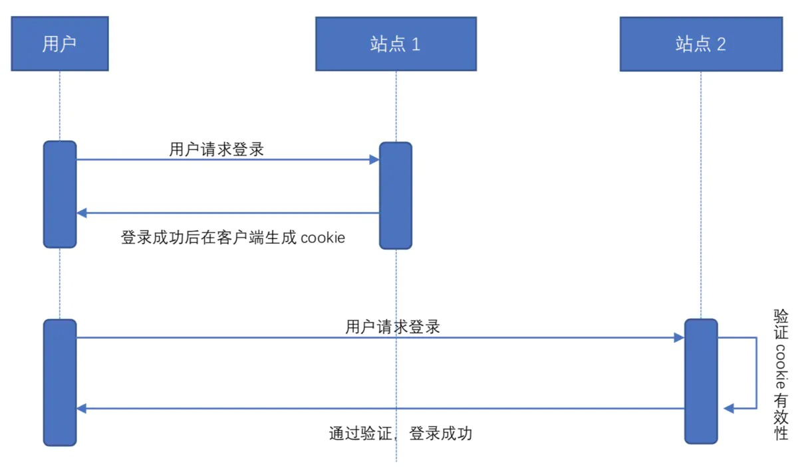
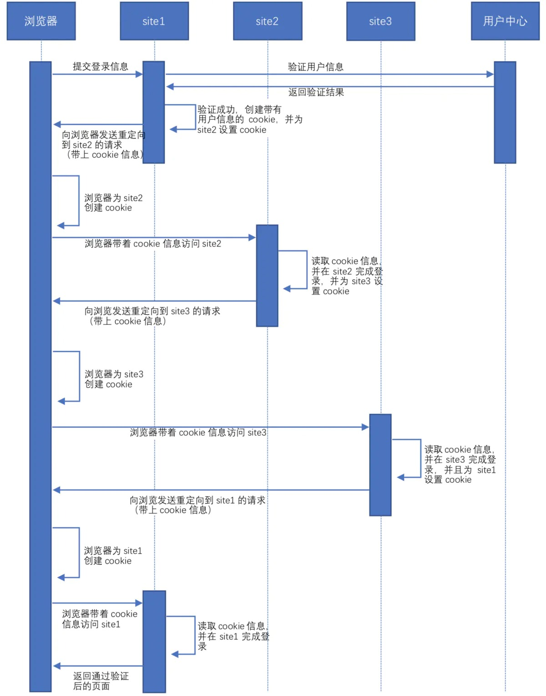
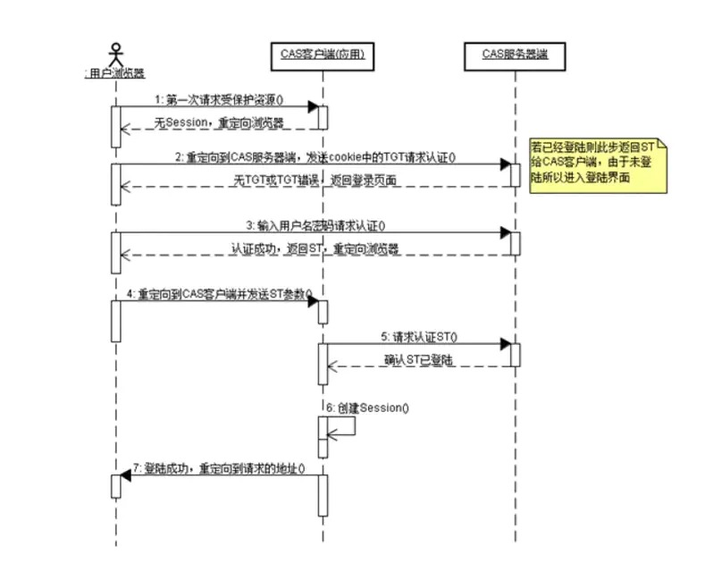
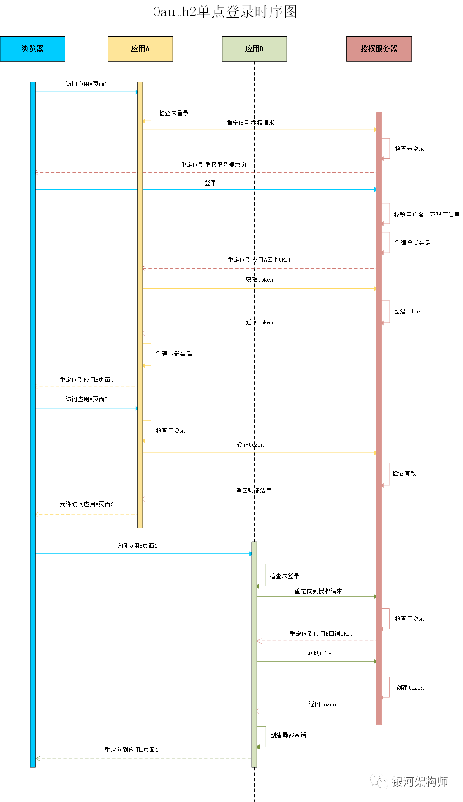

# SSO常见解决方案及基本原理

## 一、背景

在企业发展初期，企业使用的系统很少，通常一个或者两个，每个系统都有自己的登录模块，运营人员每天用自己的账号登录，很方便。
但随着企业的发展，用到的系统随之增多，运营人员在操作不同的系统时，需要多次登录，而且每个系统的账号都不一样，这对于运营人员
来说，很不方便。于是，就想到是不是可以在一个系统登录，其他系统就不用登录了呢？这就是单点登录要解决的问题。

单点登录英文全称Single Sign On，简称就是SSO。它的解释是：**在多个应用系统中，只需要登录一次，就可以访问其他相互信任的应用系统。**


如图所示，图中有4个系统，分别是Application1、Application2、Application3、和SSO。Application1、Application2、Application3没有登录模块，而SSO只有登录模块，没有其他的业务模块，当Application1、Application2、Application3需要登录时，将跳到SSO系统，SSO系统完成登录，其他的应用系统也就随之登录了。这完全符合我们对单点登录（SSO）的定义

## 二、技术实现

### 1、普通的登录认证机制


如上图所示，我们在浏览器（Browser）中访问一个应用，这个应用需要登录，我们填写完用户名和密码后，完成登录认证。这时，我们在这个用户的session中标记登录状态为yes（已登录），同时在浏览器（Browser）中写入Cookie，这个Cookie是这个用户的唯一标识。下次我们再访问这个应用的时候，请求中会带上这个Cookie，服务端会根据这个Cookie找到对应的session，通过session来判断这个用户是否登录。如果不做特殊配置，这个Cookie的名字叫做jsessionid，值在服务端（server）是唯一的。

### 同域下的单点登录

#### 同域下不同站点的SSO（跨站点）

两个站点如果在同域下，那么它们之间是可以共享cookie的。简单的说就是这种同域下不同站点的sso实现可以通过cookie来实现，当用户访问这个域下面的任意站点时，浏览器都会将这个cookie发送给站点对应的系统。
 举个简单的例子：
 站点1:[www.ssotest.com/site1](https://link.jianshu.com?t=http%3A%2F%2Fwww.ssotest.com%2Fsite1)
 站点2:[www.ssotest.com/site2](https://link.jianshu.com?t=http%3A%2F%2Fwww.ssotest.com%2Fsite2)
 从上面可以看出，这两个站点是在相同域名（[www.ssotest.com](https://link.jianshu.com?t=http%3A%2F%2Fwww.ssotest.com)）下，那么从站点1登录时，会在浏览器存储一些cookie，当在站点1下做任何操作时都会将这些cookie发送给站点1，同理，当访问站点2时，由于站点2和站点1在同一个域名下面，所以也会将这些cookie发送给站点2，所以这样的话就能够实现SSO了。可参考图1:



​																	图1 利用cookie实现同域不同站点单点登录图


#### 2）同域但不同子域名的SSO（跨子域）

指相同父域，但是不同二级域名的单点登录，例如如下有两个站点：

```css
subsite1.ssotest.com
subsite2.ssotest.com
```

从上面可以看出，它们的父域都是.ssotest.com，但是它们的二级域名不相同，所有如果在subsite1站点直接创建cookie，那么subsite2站点是不能够获取到subsite1的cookie的，所以如果直接在subsite1站点登录，将无法实现单点登录，那么如何才能实现这种情况的SSO呢？
 实现它们之间的SSO最关键的一点是：实现cookie共享和session共享，保持二者的sessionId相同。
 解决方案如下：
 1.如果是使用的spring boot框架的后台应用，只需要在application.properties配置文件中添加上如下配置即可（因为内嵌tomcat）：

```properties
server.session.cookie.path=/
server.session.cookie.domain=.ssotest.com
注意：server.session.cookie.domain不能设置为公共后缀，比如：.com，.cn
```

2.如果使用外部tomcat，那么需要在server.xml文件中添加如下配置：

```xml
<Context path="指定访问该web应用的url入口" docBase="指定web应用的文件路径" reloadable="false" useHttpOnly="true" sessionCookiePath="/" sessionCookieDomain=".ssotest.com" />
```


### 不同域的SSO（跨域）的单点登录

要实现这种跨域方式的SSO，有两种方式：
 1.使用cookie，在各个应用之间重定向
 2.使用单独的SSO服务器（更优）
 那么下面详细的介绍上面这两种方式，以如下三个站点（应用）来具体描述：

```css
www.site1.com
www.site2.com
www.site3.com
```

#### 1）第一种方式：凭借cookie，应用间的重定向

这种方式比较简单，当用户在上面三个站点中的任意一个站点登录成功时，必须在浏览器中同时设置其他站点的cookie信息。
 例如：当用户登录site1站点，并且验证通过之后，浏览器会存储一份site1站点的cookie信息，这时，为了实现单点登录（为了在site2站点和site3站点无需登录），那么我们需要在浏览器设置site2站点和site3站点的cookie信息，因此，在用户登录site1站点的请求响应之前，需要从siteId1站点重定向到site2站点和site3站点去设置cookie信息，这样就可以保证，在任意站点登录成功之后，在浏览器也有其他站点的cookie信息。下图2可具体展示其中流程：




​																图2 cookie结合重定向实现跨域SSO


优点：这种方式其实过程比较简单，只需要确保登录其中一个站点在浏览器设置cookie其他站点都在浏览器设置对应cookie，就可以实现单点登录了（单点退出是一样的道理，一个退出清除cookie，其他也清除），可以通过后端的response写，也可以用前端js去写，但是必须有对所有需要“单点登录”的站点进行逐一的写入
 缺点：因为你需要维护一个站点的列表，维护工作十分复杂，同时对于增加站点也会特别痛苦。对于Cookie的销毁也是十分复杂的，因为还是要对所有域名下的Cookie进行删除。也就是说将原来需要做的工作增加了n倍。对于小型站点这种办法是可取的。


#### 2）第二种方式：借助中间态的SSO服务器

这种办法算是一个简化版的SSO，实现思想也十分的“狡猾”。但是对于小网站做跨域登录的处理却十分的有用，具体思路如下：

首先，我们有两个域名要实现单点登录，同时我们需要一个中间的Server。

1. 我们有一个系统域名为xulingbo.net,当我们登录的时候访问xulingbo.net/wp-login进行登录，登录成功之后将Cookie回写到xulingbo这个域名下。
2. 我们还有一个系统域名为javaWeb.com，当我们访问inside-javaWeb的时候，我们没有Cookie，那么请求跳转到中间系统jump。此时需要将当前域名带到参数中便于jump校验。这个jump系统是在xulingbo域下的即：jump.xulingbo.net。这时候就能拿到之前写在xulingbo域下的Cookie。
3. jump系统在收到了xulingbo域下的Cookie之后，取出xulingbo域下的Cookie，并redirect请求jump.inside-javaWeb.net,这个接口也是在jump系统中，请求后jump系统将Cookie回写到inside-javaWeb域名下，这样就实现了简易的单点登录。 如下图所示。


#### 3、第三种基于CAS的SSO系统


CAS全称为：Central Authentication Service,是一款不错的针对web应用的单点登录框架，包括java，.net，PHP，Prel，Apache，uPortal，Ruby等。。实现的机制不算复杂但是思想十分灵巧。用CAS也可以快速实现单点登录。盗图一张说明sso单个域的登录和验证流程：





CAS主要分为CAS Client 和CAS Server ，其中Client主要是内嵌在需要SSO登录站点的拦截器或过滤器上。

1. 首先浏览器向站点1发起请求。
2. 站点1发现当前请求没有合法的Cookie，那么重定向到CAS Server上，也就是SSO Server。
3. CAS Server展示登录界面，要求用户登录。
4. 用户登录后，会写CAS Server的Cookie到浏览器，同时生产ticket，利用一个302跳转到CASClient。这样能保证用户无感知。
5. CAS Client利用生成的ticket发送到CAS Server进行验证，验证通过后，站点1生成自己的Cookie并回写到用户浏览器，然后进行登录成功的跳转。

这样就能保证当前浏览器在站点1的域名下，有站点1的Cookie，同时当前浏览器也有CAS Server的Cookie。 接下来看下站点2的登录：


站点2，在进行登录时和站点1初次登录流程一致，但是在访问CAS Server的时候，由于当前浏览器已经有了CAS Server的Cookie，那么直接校验通过返回ticket。 ticket通过302跳转跳转到CAS Client上，之后的流程就和站点1是一样的了。如果此时认证失败，那么需要重新走一次登录的过程。


注意的问题： 1、CAS Server的Cookie劫持问题，如果CAS Server的Cookie被劫持掉，那么就相当于拿到了一切，所以必须要用HTTPS实现这个过程。 2、ticket的使用，ticket只能被使用一次，一次校验后立即失效。同时需要有时效性，一般5分钟。最后ticket生成规则要随机，不能被碰撞出来。 3、对于各自系统自己的Session，也可以依赖于SSO，这样就能保证所有的Session规则一致，便于集中控制。


### oauth2 单点登录




